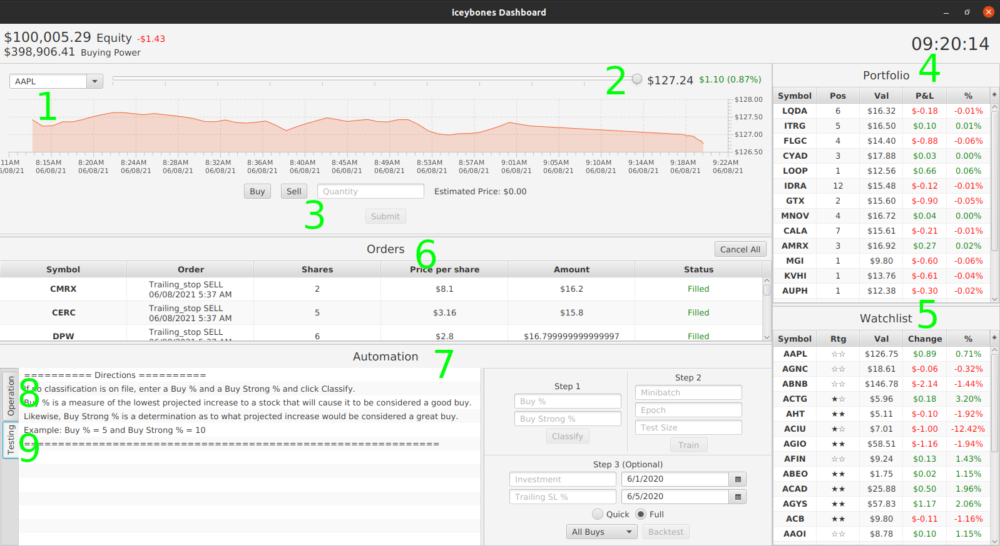

# StockBot V1
## Installation Guide

## Prerequisites:
    • Java 16
    • Alpaca Markets brokerage account https://app.alpaca.markets/signup (Optional) – A paper trading account is provided.
## Windows:
    1) Unzip data.zip in a folder alongside launcher_win.jar.
    2) With Java 16 installed, simply double click on launcher_win.jar to run the application.
    3) Press the login button to continue with the provided paper trading account OR enter your account details provided by Alpaca Markets.
## Linux
    1) Unzip data.zip in a folder alongside launcher_lin.jar.
    2) With Java 16 installed, open a terminal at the current directory and run the command "java -jar launcher_lin.jar".
    3) Press login button to continue with the provided paper trading account OR enter your account details provided by Alpaca Markets.
## User Guide
Complete directions on how to best use the application can be found in the “Automation” section of the GUI. Outlined below are the main sections of the GUI and their uses. Individual sections of the GUI can be dragged to adjust their size and/or hide unused sections.
    1) Enter a company name or stock ticker symbol to view current market data and/or manually buy a stock.
    2) Move the slider to the left to include older data in the graph.
    3) Manually buy or sell the currently displayed stock. Currently, only market orders are available.
    4) All open positions are displayed here.
    5) The watch list displays stocks that have been evaluated by the operation function. Ratings are displayed as either zero, one or two black stars that correspond to classifications made by the evaluation function. Zero = Sell, One = Buy, Two = Strong Buy.
    6) Details about the last 500 account orders are displayed here. This section also includes a button to cancel all open orders. This is currently the only way to cancel orders.
    7) The automation section is the meat and potatoes of the application and includes many functions that are fully explained within the GUI.
    8) The operation tab houses automation functions that work on real current data and performs actual buying and selling of stocks.
    9) The testing tab houses automation functions used to train and test the model used by the functions in the operation tab.

